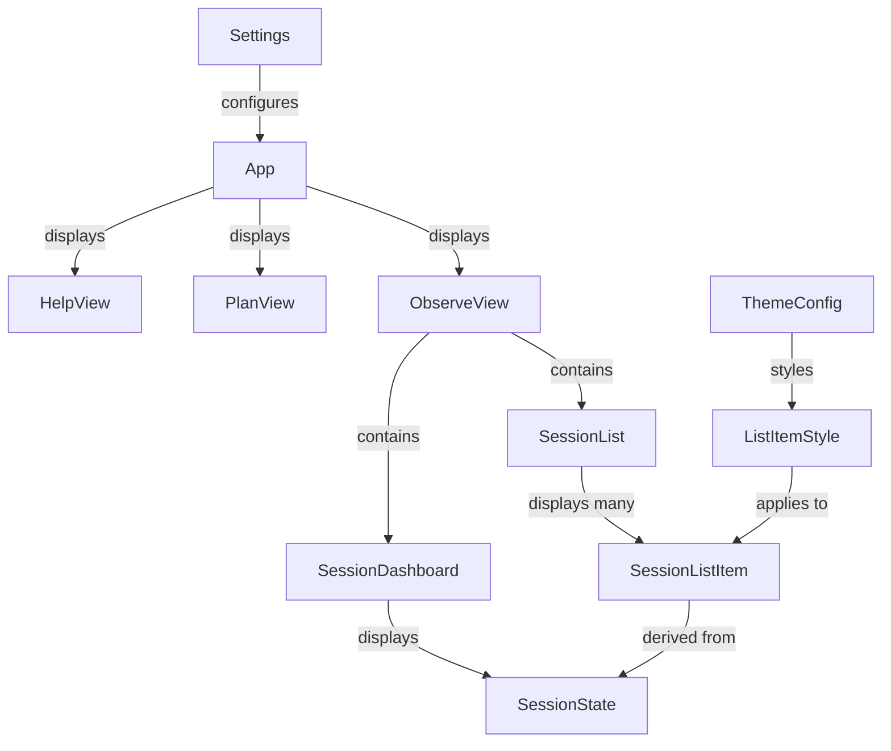

# Data Model: Bug Fixes for Specstar TUI

**Feature**: Bug Fixes for Specstar TUI
**Date**: 2025-09-09

## Overview

This document defines the data models and state transitions required for fixing the five documented bugs in the Specstar TUI application.

## Core Entities

### 1. Settings (Enhanced)

```typescript
interface Settings {
  // User Preferences
  startPage: 'plan' | 'observe' | 'help';  // NEW: Default page on launch
  
  // Theme Configuration (UPDATED structure)
  theme: ThemeConfig;
  
  // File System Configuration (sessionPath REMOVED)
  folders: {
    config: string;
    logs: string;
    cache: string;
    // sessionPath removed - hardcoded to .specstar/sessions
  };
  
  // Feature Flags
  features: {
    autoRefresh: boolean;
    darkMode: boolean;
    sessionMonitoring: boolean;
  };
}

interface ThemeConfig {
  bg: string;        // Background color (e.g., '#1e1e1e', 'black')
  fg: string;        // Foreground color (e.g., '#ffffff', 'white')
  fgAccent: string;  // Accent color for highlights (e.g., '#00ff00', 'green')
}
```

**Validation Rules**:
- `startPage` must be one of: 'plan', 'observe', 'help'
- Theme colors must be valid color strings (hex or named colors)
- If startPage is not set, default to 'help'

### 2. SessionState (Corrected)

```typescript
interface SessionState {
  // Identity
  session_id: string;
  session_title: string;
  
  // Lifecycle State (RESTRICTED UPDATES)
  session_active: boolean;  // Only modified by session_start/session_end
  
  // Timestamps
  created_at: string;       // ISO 8601 format
  updated_at: string;       // ISO 8601 format
  
  // Activity Metrics
  agents: {
    active: string[];       // Currently running agents
    completed: string[];    // Finished agents
  };
  
  // File Operations
  files: {
    read: string[];        // Files read during session
    edited: string[];      // Files edited
    created: string[];     // New files created
  };
  
  // Tool Usage
  tools: {
    [toolName: string]: number;  // Count of tool invocations
  };
  
  // Error Tracking
  errors: Array<{
    timestamp: string;
    message: string;
    context?: any;
  }>;
}
```

**State Transitions**:
- `session_active`: 
  - `false → true`: Only via `session_start` hook
  - `true → false`: Only via `session_end` hook
  - No other transitions allowed

### 3. SessionListItem (New)

```typescript
interface SessionListItem {
  id: string;
  title: string;
  isActive: boolean;
  lastActivity: string;  // ISO 8601 timestamp
  agentCount: number;    // Total agents (active + completed)
  fileCount: number;     // Total file operations
}
```

**Derived from**: SessionState
**Used in**: Observe view left sidebar

### 4. ListItemStyle (New)

```typescript
interface ListItemStyle {
  isSelected: boolean;
  isActive: boolean;
  theme: ThemeConfig;
}

// Computed style properties
interface ComputedListStyle {
  textColor: string;      // Green for selected, theme.fg for normal
  backgroundColor: string; // Always transparent/none
  indicator: string;       // '●' for active sessions, ' ' for inactive
  indicatorColor: string;  // Green for active, transparent for inactive
}
```

**Usage**: Applied to all list components for consistent styling

### 5. ObserveViewLayout (New)

```typescript
interface ObserveViewLayout {
  leftPanel: {
    width: '30%';
    content: 'SessionList';
    scrollable: true;
  };
  rightPanel: {
    width: '70%';
    content: 'SessionDashboard';
    sections: [
      'identity',     // ID and title
      'status',       // Active state with indicator
      'agents',       // Agent activity
      'files',        // File operations
      'tools',        // Tool usage stats
      'errors'        // Error log if any
    ];
  };
  focusedPanel: 'left' | 'right';
}
```

## Relationships



## Data Flow

1. **Settings Loading**:
   - Load from `.specstar/settings.json` on app start
   - Apply `startPage` to determine initial view
   - Apply `theme` to all UI components

2. **Session State Updates**:
   - Hook events trigger state updates
   - Only `session_start` and `session_end` modify `session_active`
   - All other hooks update relevant metrics without touching `session_active`

3. **List Rendering**:
   - SessionMonitor provides session data
   - Transform to SessionListItem for display
   - Apply ListItemStyle based on selection and theme

4. **Session Selection**:
   - User navigates list with arrow keys
   - Enter key sets selected session
   - Dashboard updates to show selected session details

## Migration Requirements

For existing installations:
1. Add `startPage: 'help'` to existing settings.json
2. Transform `theme: "dark"` to structured ThemeConfig object
3. Remove `sessionPath` if present in settings
4. No changes needed to existing session state files

## Validation Rules

1. **Settings Validation**:
   - Validate startPage enum values
   - Validate theme color formats
   - Ensure required fields present

2. **Session State Validation**:
   - Reject session_active changes from non-lifecycle hooks
   - Validate timestamp formats
   - Ensure session_id is non-empty

3. **UI State Validation**:
   - Ensure selected index within list bounds
   - Validate panel focus state
   - Check color values before rendering