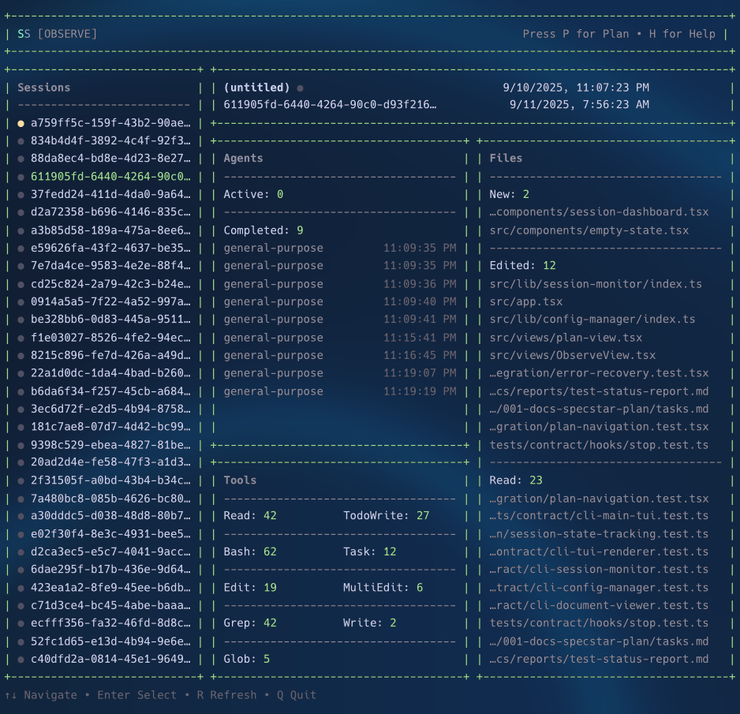

# Specstar

A terminal UI for monitoring Claude Code sessions and viewing planning documents. Built with React Ink and Bun for a responsive, keyboard-driven development experience.



## Overview

Specstar provides two main views for developers:

- **Plan View**: Browse and view markdown documents from configured project folders
- **Observe View**: Monitor active Claude Code sessions in real-time with detailed statistics and event tracking

## Quick Start

### Installation

```bash
# Clone the repository
git clone https://github.com/dylan-gluck/specstar.git
cd specstar

# Install dependencies
bun install

# Build the executable
bun run build

# Install globally (optional)
bun run install:global
```

### Initialize in Your Project

```bash
# Navigate to your project directory
cd your-project

# Initialize Specstar configuration
specstar --init

# Launch the TUI
specstar
```

### Basic Usage

- **Launch TUI**: `specstar`
- **Initialize project**: `specstar --init`
- **Force overwrite config**: `specstar --init --force`
- **Show help**: `specstar --help` or `specstar -h`
- **Show version**: `specstar --version` or `specstar -v`

## Development Setup

### Prerequisites

- [Bun](https://bun.sh) runtime
- TypeScript 5+

### Development Commands

```bash
# Install dependencies
bun install

# Run in development mode
bun run dev

# Run tests
bun test

# Run tests with coverage
bun test:coverage

# Run tests in watch mode
bun test:watch

# Type checking
bun run typecheck

# Build single executable
bun run build

# Clean build artifacts
bun run clean
```

### Project Scripts

| Script | Command | Description |
|--------|---------|-------------|
| `dev` | `bun run src/cli.tsx` | Development mode |
| `build` | `bun build --compile --outfile=dist/specstar src/cli.tsx` | Build executable |
| `test` | `bun test` | Run test suite |
| `test:watch` | `bun test --watch` | Watch mode testing |
| `test:coverage` | `bun test --coverage` | Coverage report |
| `lint` | `tsc --noEmit` | Type checking |
| `install:global` | Build and install to `/usr/local/bin/` | Global installation |
| `clean` | Remove build artifacts and logs | Cleanup |

## Project Architecture

### Directory Structure

```
specstar/
├── src/
│   ├── app.tsx              # Main application component
│   ├── cli.tsx              # CLI entry point and argument parsing
│   ├── index.ts             # Public API exports
│   ├── components/          # Reusable UI components
│   │   ├── error-boundary.tsx
│   │   ├── file-list.tsx
│   │   ├── focus-box.tsx
│   │   ├── loading-spinner.tsx
│   │   ├── markdown-viewer.tsx
│   │   ├── session-dashboard.tsx
│   │   └── empty-state.tsx
│   ├── views/               # Main application views
│   │   ├── plan-view.tsx    # Document browsing and viewing
│   │   └── ObserveView.tsx  # Session monitoring
│   ├── lib/                 # Core libraries
│   │   ├── config-manager/  # Settings and initialization
│   │   ├── session-monitor/ # Claude Code session tracking
│   │   ├── document-viewer/ # Markdown processing
│   │   ├── tui-renderer/    # Terminal UI utilities
│   │   └── logger/          # Structured logging
│   └── models/              # TypeScript type definitions
│       ├── session.ts
│       ├── document.ts
│       ├── settings.ts
│       ├── hook-event.ts
│       └── log-entry.ts
├── .specstar/               # User configuration directory
│   ├── settings.json        # Application settings
│   ├── sessions/            # Session data storage
│   ├── logs/                # Application logs
│   └── hooks.ts             # Claude Code lifecycle hooks
├── dist/                    # Build output
└── package.json
```

### Architecture Components

```
┌─────────────────────────────────────────────────────────────┐
│                        CLI Entry                            │
│                      (cli.tsx)                             │
└─────────────────────────┬───────────────────────────────────┘
                          │
┌─────────────────────────▼───────────────────────────────────┐
│                     App Router                             │
│                     (app.tsx)                              │
│  ┌─────────────────┐  ┌─────────────────┐  ┌─────────────┐  │
│  │   Plan View     │  │  Observe View   │  │ Welcome View│  │
│  │                 │  │                 │  │             │  │
│  │ ┌─────────────┐ │  │ ┌─────────────┐ │  │ Help & Nav  │  │
│  │ │ File Lists  │ │  │ │Session List │ │  │             │  │
│  │ │             │ │  │ │             │ │  │             │  │
│  │ └─────────────┘ │  │ └─────────────┘ │  │             │  │
│  │ ┌─────────────┐ │  │ ┌─────────────┐ │  │             │  │
│  │ │   Markdown  │ │  │ │ Dashboard   │ │  │             │  │
│  │ │   Viewer    │ │  │ │             │ │  │             │  │
│  │ └─────────────┘ │  │ └─────────────┘ │  │             │  │
│  └─────────────────┘  └─────────────────┘  └─────────────┘  │
└─────────────────────────┬───────────────────────────────────┘
                          │
┌─────────────────────────▼───────────────────────────────────┐
│                   Core Libraries                           │
│                                                            │
│  ┌───────────────┐ ┌────────────────┐ ┌─────────────────┐  │
│  │ ConfigManager │ │ SessionMonitor │ │ DocumentViewer  │  │
│  │               │ │                │ │                 │  │
│  │ - Settings    │ │ - File Watching│ │ - Markdown      │  │
│  │ - Init/Setup  │ │ - Event Stream │ │ - Frontmatter   │  │
│  │ - Validation  │ │ - Statistics   │ │ - Syntax Highlight│  │
│  └───────────────┘ └────────────────┘ └─────────────────┘  │
│                                                            │
│  ┌───────────────┐ ┌────────────────┐ ┌─────────────────┐  │
│  │ TUIRenderer   │ │     Logger     │ │   File System   │  │
│  │               │ │                │ │                 │  │
│  │ - Focus Mgmt  │ │ - Structured   │ │ - Config Files  │  │
│  │ - Navigation  │ │ - File Output  │ │ - Session Data  │  │
│  │ - Layout      │ │ - Error Track  │ │ - Document Cache│  │
│  └───────────────┘ └────────────────┘ └─────────────────┘  │
└─────────────────────────────────────────────────────────────┘
```

### Key Features

- **Keyboard Navigation**: Full keyboard-driven interface with Vim-like navigation
- **Real-time Monitoring**: Watch Claude Code sessions with live updates
- **Document Management**: Browse and view project documentation with syntax highlighting
- **Error Recovery**: Robust error handling with automatic recovery options
- **Configurable**: JSON-based configuration with folder watching
- **Session Persistence**: Automatic session data storage and history
- **Logging**: Structured logging with file output for debugging

### Navigation

| Key | Action |
|-----|--------|
| `P` | Switch to Plan view |
| `O` | Switch to Observe view |
| `H` or `?` | Show help/welcome screen |
| `Q` | Quit application |
| `1-9` | Select folder/list (Plan view) |
| `V` | Focus on viewer pane |
| `↑↓` | Navigate lists |
| `Enter` | Select item |
| `R` | Refresh data |

## Contributing

### Development Workflow

1. **Fork and clone** the repository
2. **Install dependencies**: `bun install`
3. **Create a feature branch**: `git checkout -b feature/your-feature`
4. **Make your changes** following the existing code style
5. **Write tests** for new functionality
6. **Run tests**: `bun test`
7. **Type check**: `bun run typecheck`
8. **Build and test**: `bun run build`
9. **Commit and push** your changes
10. **Submit a pull request**

### Testing Guidelines

The project follows Test-Driven Development (TDD) with this priority:

1. **Contract tests** - CLI interfaces and public APIs
2. **Integration tests** - File system operations and hooks
3. **E2E tests** - Full TUI interaction flows
4. **Unit tests** - Component logic and utilities

### Code Style

- Use **TypeScript** with strict type checking
- Follow **React Hooks** patterns for state management
- Use **Ink components** for UI rendering
- Implement **error boundaries** for fault tolerance
- Write **JSDoc comments** for public APIs
- Use **structured logging** for debugging

## License

This project does not currently have a license file. Please check with the project maintainers for licensing information.

## Support

For issues, questions, or contributions:

1. Check existing issues in the repository
2. Review the documentation and code comments
3. Check `.specstar/logs/` for error details
4. Submit detailed bug reports with reproduction steps

---

Built with ❤️ using [Bun](https://bun.sh) and [React Ink](https://github.com/vadimdemedes/ink)
