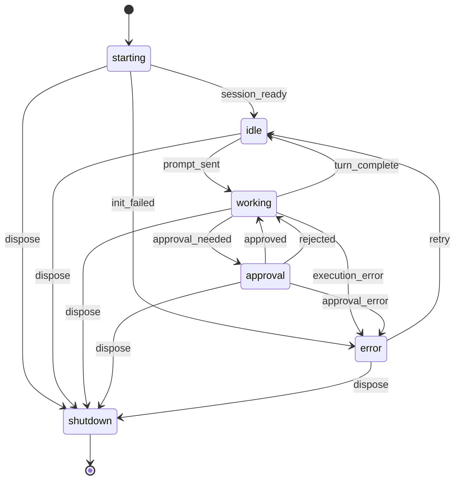
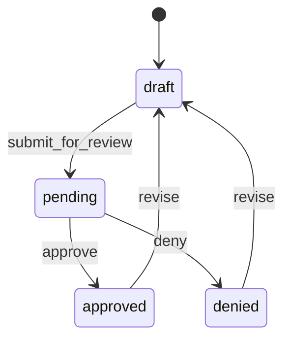

# Data Model: Issue-Centric TUI

**Feature**: 001-issue-centric-tui
**Status**: Phase 1 Design Artifact

---

## 1. Entity Definitions

### 1.1 LinearIssue

The primary entity. Sourced from Linear API, cached in SQLite `issues` table.

```typescript
interface LinearIssue {
  /** Linear issue UUID. */
  id: string;
  /** Human-readable identifier, e.g. "AUTH-142". */
  identifier: string;
  title: string;
  description: string | null;
  /** Linear workflow state name, e.g. "In Progress", "Todo". */
  state: string;
  /** 0 = No priority, 1 = Urgent, 2 = High, 3 = Medium, 4 = Low. */
  priority: number;
  assignee: string | null;
  /** Git branch name assigned by Linear, e.g. "auth-142". */
  branch: string | null;
  /** Notion page ID for linked spec. */
  specDocId: string | null;
  url: string;
  updatedAt: string; // ISO 8601
  /** Full Linear API JSON response for cache. */
  rawJson: string;
}
```

**Owner**: Linear integration service.
**Relationships**: Linked to other entities by `branch` (session, PR, worktree) and `id` (spec via `issueId`).

---

### 1.2 WorkerSession

An agent execution context. Managed by the session pool, state persisted in SQLite `sessions` table.

```typescript
/** Branded session identifier. */
type SessionId = string & { readonly __brand: unique symbol };

interface WorkerSession {
  id: SessionId;
  name: string;
  status: WorkerStatus;
  /** Absolute path to the session's working directory. */
  cwd: string;
  /** Path to the worktree this session operates in, if any. */
  worktreePath: string | null;
  /** Workflow that spawned this session, if any. */
  workflowId: string | null;
  /** Git branch the session is working on. */
  branch: string | null;
  /** Explicit link to an issue identifier when branch matching is ambiguous. */
  issueIdentifier: string | null;
  model: string | null;
  startedAt: string; // ISO 8601
  lastActivityAt: string; // ISO 8601
  tokenCount: number;
}
```

**Owner**: Session pool service.
**Relationships**: Linked to an issue by:

1. `branch` matching `LinearIssue.branch`, OR
2. `issueIdentifier` matching `LinearIssue.identifier`, OR
3. `worktreePath` matching a `Worktree.path` whose `branch` matches an issue.

---

### 1.3 NotionSpec

A technical specification document. Sourced from Notion API, cached in SQLite `specs` table.

```typescript
interface NotionSpec {
  /** Notion page ID. */
  id: string;
  /** Linear issue ID this spec is linked to. */
  issueId: string;
  title: string;
  status: SpecStatus;
  url: string;
  updatedAt: string; // ISO 8601
}
```

**Owner**: Notion integration service.
**Relationships**: Linked to an issue by `issueId` matching `LinearIssue.id`.

---

### 1.4 GithubPR

A pull request. Sourced from GitHub API, cached in SQLite `pull_requests` table.

```typescript
interface GithubPR {
  number: number;
  title: string;
  author: string;
  state: PRState;
  /** CI check status. */
  ciStatus: "pass" | "fail" | "pending" | "none" | null;
  /** Review decision from GitHub. */
  reviewDecision: "approved" | "changes_requested" | "review_required" | null;
  /** Source branch, e.g. "auth-142". */
  headRef: string;
  url: string;
  /** Issue identifier extracted from branch or title. */
  ticketId: string | null;
  updatedAt: string; // ISO 8601
  rawJson: string;
}
```

**Owner**: GitHub integration service.
**Relationships**: Linked to an issue by:

1. `headRef` matching `LinearIssue.branch`, OR
2. `ticketId` matching `LinearIssue.identifier` (extracted via regex from branch/title).

---

### 1.5 Worktree

A local git working tree. Discovered by scanning the filesystem, cached in SQLite `worktrees` table.

```typescript
interface Worktree {
  /** Absolute filesystem path. */
  path: string;
  branch: string;
  commitHash: string;
  sessionId: SessionId | null;
  /** Issue identifier linked to this worktree. */
  ticketId: string | null;
  prNumber: number | null;
  isDirty: boolean;
  updatedAt: string; // ISO 8601
}
```

**Owner**: Worktree manager service.
**Relationships**: Linked to an issue by `branch` matching `LinearIssue.branch` or `ticketId` matching `LinearIssue.identifier`.

---

### 1.6 Workflow

A named pipeline of headless agent sessions. Not persisted in SQLite; loaded from YAML definitions on disk.

```typescript
interface Workflow {
  id: string;
  name: string;
  description: string;
  /** Path to the workflow YAML definition. */
  definitionPath: string;
  /** Workflow types determine which command palette category they appear in. */
  type: "capture" | "refine" | "draft_spec" | "implement" | "review" | "cycle_planning" | "custom";
}
```

**Owner**: Workflow engine service.
**Relationships**: A workflow execution spawns one or more `WorkerSession` entries linked by `workflowId`.

---

### 1.7 MemoryEntry

Project memory stored in SQLite `memory_entries` table. Not issue-centric; global context.

```typescript
interface MemoryEntry {
  id: number;
  category: "project" | "people" | "glossary";
  key: string;
  value: string;
  updatedAt: string; // ISO 8601
}
```

**Owner**: Memory service.
**Relationships**: None to issues. Consumed by agent sessions for context.

---

### 1.8 EnrichedIssue

The computed projection that powers the issue-centric view. Not stored in SQLite. Produced by the enrichment algorithm at the application layer.

```typescript
type IssueSection = "attention" | "active" | "backlog";

interface EnrichedIssue {
  /** The underlying Linear issue. */
  issue: LinearIssue;
  /** All sessions linked to this issue. May be empty. */
  sessions: WorkerSession[];
  /** Most recent PR linked to this issue, if any. */
  pr: GithubPR | null;
  /** Linked technical spec, if any. */
  spec: NotionSpec | null;
  /** Linked worktree, if any. */
  worktree: Worktree | null;
  /** Computed section assignment. */
  section: IssueSection;
  /** Computed status badge (most urgent status). */
  badge: StatusBadge;
}
```

See [Section 2](#2-enriched-issue-model) for the enrichment algorithm.

---

### 1.9 UnlinkedSession

A session that does not match any tracked issue.

```typescript
interface UnlinkedSession {
  kind: "session";
  session: WorkerSession;
  badge: StatusBadge;
}
```

### 1.10 UnlinkedPR

A PR that does not match any tracked issue.

```typescript
interface UnlinkedPR {
  kind: "pr";
  pr: GithubPR;
  badge: StatusBadge;
}
```

### 1.11 UnlinkedItem (discriminated union)

```typescript
type UnlinkedItem = UnlinkedSession | UnlinkedPR;
```

Badge computation for unlinked items uses the same `resolveBadge` logic but operates on a single artifact rather than an enriched issue. See [Section 6](#6-badge-priority).

---

### 1.12 IssueListModel

The complete model driving the left pane.

```typescript
interface IssueListModel {
  attention: EnrichedIssue[];
  active: EnrichedIssue[];
  backlog: EnrichedIssue[];
  unlinked: UnlinkedItem[];
}
```

---

## 2. Enriched Issue Model

### 2.1 Enrichment Algorithm

Enrichment is a **pure function** that runs after each refresh cycle. It takes raw data from all integration caches and produces `EnrichedIssue[]` plus `UnlinkedItem[]`.

```typescript
function enrich(
  issues: LinearIssue[],
  sessions: WorkerSession[],
  prs: GithubPR[],
  specs: NotionSpec[],
  worktrees: Worktree[],
): { enriched: EnrichedIssue[]; unlinked: UnlinkedItem[] };
```

**Step 1: Build lookup indexes.**

```typescript
// Branch -> Issue (many issues may share a branch in theory; use first match)
const branchToIssue = new Map<string, LinearIssue>();
// Identifier -> Issue (e.g. "AUTH-142" -> issue)
const identifierToIssue = new Map<string, LinearIssue>();
// Issue ID -> Issue
const idToIssue = new Map<string, LinearIssue>();

for (const issue of issues) {
  idToIssue.set(issue.id, issue);
  identifierToIssue.set(issue.identifier.toUpperCase(), issue);
  if (issue.branch) {
    branchToIssue.set(issue.branch, issue);
  }
}
```

**Step 2: Identifier extraction regex.**

Extracts an issue identifier from a branch name or PR title.

```typescript
const IDENTIFIER_PATTERN = /^([A-Z]+-\d+)/i;

function extractIdentifier(text: string): string | null {
  // Try exact match first
  const match = text.match(IDENTIFIER_PATTERN);
  if (match) return match[1].toUpperCase();

  // Try with common prefixes stripped (e.g. "feature/auth-142")
  const slashIdx = text.lastIndexOf("/");
  if (slashIdx !== -1) {
    const suffix = text.slice(slashIdx + 1);
    const suffixMatch = suffix.match(IDENTIFIER_PATTERN);
    if (suffixMatch) return suffixMatch[1].toUpperCase();
  }

  return null;
}
```

**Step 3: Link sessions to issues.**

```typescript
const issueSessionsMap = new Map<string, WorkerSession[]>(); // issue.id -> sessions
const linkedSessionIds = new Set<string>();

for (const session of sessions) {
  let matchedIssue: LinearIssue | undefined;

  // Priority 1: Explicit issue_identifier field
  if (session.issueIdentifier) {
    matchedIssue = identifierToIssue.get(session.issueIdentifier.toUpperCase());
  }

  // Priority 2: Session branch matches issue branch
  if (!matchedIssue && session.branch) {
    matchedIssue = branchToIssue.get(session.branch);
  }

  // Priority 3: Session branch contains issue identifier
  if (!matchedIssue && session.branch) {
    const id = extractIdentifier(session.branch);
    if (id) matchedIssue = identifierToIssue.get(id);
  }

  // Priority 4: Session worktree path matches a worktree linked to an issue
  if (!matchedIssue && session.worktreePath) {
    const wt = worktrees.find((w) => w.path === session.worktreePath);
    if (wt) {
      matchedIssue = branchToIssue.get(wt.branch);
      if (!matchedIssue) {
        const id = extractIdentifier(wt.branch);
        if (id) matchedIssue = identifierToIssue.get(id);
      }
    }
  }

  if (matchedIssue) {
    const list = issueSessionsMap.get(matchedIssue.id) ?? [];
    list.push(session);
    issueSessionsMap.set(matchedIssue.id, list);
    linkedSessionIds.add(session.id);
  }
}
```

**Step 4: Link PRs to issues.** (analogous)

```typescript
const issuePRMap = new Map<string, GithubPR>(); // issue.id -> PR (most recent)
const linkedPRNumbers = new Set<number>();

for (const pr of prs) {
  let matchedIssue: LinearIssue | undefined;

  // Priority 1: headRef matches issue branch exactly
  matchedIssue = branchToIssue.get(pr.headRef);

  // Priority 2: ticketId matches issue identifier
  if (!matchedIssue && pr.ticketId) {
    matchedIssue = identifierToIssue.get(pr.ticketId.toUpperCase());
  }

  // Priority 3: Extract identifier from headRef
  if (!matchedIssue) {
    const id = extractIdentifier(pr.headRef);
    if (id) matchedIssue = identifierToIssue.get(id);
  }

  if (matchedIssue) {
    // Keep most recently updated PR if multiple match
    const existing = issuePRMap.get(matchedIssue.id);
    if (!existing || pr.updatedAt > existing.updatedAt) {
      issuePRMap.set(matchedIssue.id, pr);
    }
    linkedPRNumbers.add(pr.number);
  }
}
```

**Step 5: Link specs and worktrees to issues.**

```typescript
const issueSpecMap = new Map<string, NotionSpec>(); // issue.id -> spec
for (const spec of specs) {
  issueSpecMap.set(spec.issueId, spec);
}

const issueWorktreeMap = new Map<string, Worktree>(); // issue.id -> worktree
for (const wt of worktrees) {
  let matchedIssue = branchToIssue.get(wt.branch);
  if (!matchedIssue) {
    const id = extractIdentifier(wt.branch);
    if (id) matchedIssue = identifierToIssue.get(id);
  }
  if (matchedIssue) {
    issueWorktreeMap.set(matchedIssue.id, wt);
  }
}
```

**Step 6: Assemble enriched issues.**

```typescript
const enriched: EnrichedIssue[] = issues.map((issue) => {
  const linked = {
    sessions: issueSessionsMap.get(issue.id) ?? [],
    pr: issuePRMap.get(issue.id) ?? null,
    spec: issueSpecMap.get(issue.id) ?? null,
    worktree: issueWorktreeMap.get(issue.id) ?? null,
  };
  return {
    issue,
    ...linked,
    section: assignSection(issue, linked),
    badge: resolveBadge(issue, linked),
  };
});
```

**Step 7: Collect unlinked items.**

```typescript
const unlinked: UnlinkedItem[] = [
  ...prs
    .filter((pr) => !linkedPRNumbers.has(pr.number))
    .map(
      (pr): UnlinkedPR => ({
        kind: "pr",
        pr,
        badge: resolvePRBadge(pr),
      }),
    ),
  ...sessions
    .filter((s) => !linkedSessionIds.has(s.id))
    .map(
      (s): UnlinkedSession => ({
        kind: "session",
        session: s,
        badge: resolveSessionBadge(s),
      }),
    ),
];
```

---

## 3. Unlinked Items

### 3.1 UnlinkedSession Badge

Uses `resolveSessionBadge`:

| `session.status` | Badge    |
| ---------------- | -------- |
| `approval`       | `apprvl` |
| `error`          | `error`  |
| `working`        | `wrkng`  |
| `idle`           | `idle`   |
| `starting`       | `idle`   |
| `shutdown`       | `--`     |

### 3.2 UnlinkedPR Badge

Uses `resolvePRBadge`:

| Condition (evaluated in order)     | Badge     |
| ---------------------------------- | --------- |
| `pr.ciStatus === "fail"`           | `ci:fail` |
| `pr.state === "merged"`            | `merged`  |
| `pr.state === "closed"`            | `--`      |
| `pr.reviewDecision === "approved"` | `review`  |
| `pr.ciStatus === "pass"`           | `ci:pass` |
| `pr.state === "draft"`             | `draft`   |
| `pr.state === "open"`              | `review`  |
| fallback                           | `--`      |

---

## 4. SQLite Schema

### 4.1 Tables

```sql
CREATE TABLE issues (
  id            TEXT PRIMARY KEY,
  identifier    TEXT NOT NULL,         -- e.g. "AUTH-142"
  title         TEXT NOT NULL,
  description   TEXT,
  state         TEXT NOT NULL,
  priority      INTEGER NOT NULL,
  assignee      TEXT,
  branch        TEXT,
  spec_doc_id   TEXT,                  -- Notion document ID
  url           TEXT NOT NULL,
  updated_at    TEXT NOT NULL,
  raw_json      TEXT NOT NULL           -- Full API response for cache
);

CREATE TABLE pull_requests (
  number          INTEGER PRIMARY KEY,
  title           TEXT NOT NULL,
  author          TEXT NOT NULL,
  state           TEXT NOT NULL,         -- open, closed, merged, draft
  ci_status       TEXT,                  -- pass, fail, pending, none
  review_decision TEXT,
  head_ref        TEXT NOT NULL,
  url             TEXT NOT NULL,
  ticket_id       TEXT,                  -- Linked issue identifier
  updated_at      TEXT NOT NULL,
  raw_json        TEXT NOT NULL
);

CREATE TABLE worktrees (
  path          TEXT PRIMARY KEY,
  branch        TEXT NOT NULL,
  commit_hash   TEXT NOT NULL,
  session_id    TEXT,
  ticket_id     TEXT,
  pr_number     INTEGER,
  is_dirty      INTEGER NOT NULL DEFAULT 0,
  updated_at    TEXT NOT NULL
);

CREATE TABLE sessions (
  id                TEXT PRIMARY KEY,
  name              TEXT NOT NULL,
  status            TEXT NOT NULL,         -- starting, idle, working, approval, error, shutdown
  cwd               TEXT NOT NULL,
  worktree_path     TEXT,
  workflow_id       TEXT,
  branch            TEXT,
  issue_identifier  TEXT,                  -- NEW: explicit issue link when branch matching is ambiguous
  model             TEXT,
  started_at        TEXT NOT NULL,
  last_activity_at  TEXT NOT NULL,
  token_count       INTEGER DEFAULT 0
);

CREATE TABLE specs (
  id          TEXT PRIMARY KEY,            -- Notion page ID
  issue_id    TEXT NOT NULL,
  title       TEXT NOT NULL,
  status      TEXT NOT NULL,               -- pending, approved, denied, draft
  url         TEXT NOT NULL,
  updated_at  TEXT NOT NULL
);

CREATE TABLE memory_entries (
  id          INTEGER PRIMARY KEY AUTOINCREMENT,
  category    TEXT NOT NULL,               -- project, people, glossary
  key         TEXT NOT NULL,
  value       TEXT NOT NULL,
  updated_at  TEXT NOT NULL,
  UNIQUE(category, key)
);
```

### 4.2 Indexes

```sql
-- Branch-based lookups for enrichment
CREATE INDEX idx_issues_branch ON issues(branch) WHERE branch IS NOT NULL;
CREATE INDEX idx_issues_identifier ON issues(identifier);
CREATE INDEX idx_pull_requests_head_ref ON pull_requests(head_ref);
CREATE INDEX idx_pull_requests_ticket_id ON pull_requests(ticket_id) WHERE ticket_id IS NOT NULL;
CREATE INDEX idx_worktrees_branch ON worktrees(branch);
CREATE INDEX idx_sessions_branch ON sessions(branch) WHERE branch IS NOT NULL;
CREATE INDEX idx_sessions_issue_identifier ON sessions(issue_identifier) WHERE issue_identifier IS NOT NULL;
CREATE INDEX idx_sessions_worktree_path ON sessions(worktree_path) WHERE worktree_path IS NOT NULL;
CREATE INDEX idx_sessions_status ON sessions(status);
CREATE INDEX idx_specs_issue_id ON specs(issue_id);

-- Sorting support
CREATE INDEX idx_issues_state ON issues(state);
CREATE INDEX idx_issues_priority ON issues(priority);
CREATE INDEX idx_pull_requests_state ON pull_requests(state);
```

---

## 5. State Machines

### 5.1 WorkerStatus

States for agent session lifecycle.

```typescript
type WorkerStatus = "starting" | "idle" | "working" | "approval" | "error" | "shutdown";
```

#### State Diagram



#### Transition Table

| Current State | Event             | Next State   | Guard                                                 |
| ------------- | ----------------- | ------------ | ----------------------------------------------------- |
| `starting`    | `session_ready`   | `idle`       | Agent session created successfully                    |
| `starting`    | `init_failed`     | `error`      | Session creation threw                                |
| `starting`    | `dispose`         | `shutdown`   | Always allowed                                        |
| `idle`        | `prompt_sent`     | `working`    | Prompt is non-empty string                            |
| `idle`        | `dispose`         | `shutdown`   | Always allowed                                        |
| `working`     | `turn_complete`   | `idle`       | Agent finished turn without error                     |
| `working`     | `approval_needed` | `approval`   | Tool requires human approval                          |
| `working`     | `execution_error` | `error`      | Agent threw or tool failed fatally                    |
| `working`     | `dispose`         | `shutdown`   | Always allowed (aborts current work)                  |
| `approval`    | `approved`        | `working`    | User approved the tool call                           |
| `approval`    | `rejected`        | `working`    | User rejected; agent receives rejection and continues |
| `approval`    | `approval_error`  | `error`      | Approval handler threw                                |
| `approval`    | `dispose`         | `shutdown`   | Always allowed                                        |
| `error`       | `retry`           | `idle`       | Error is recoverable; session still alive             |
| `error`       | `dispose`         | `shutdown`   | Always allowed                                        |
| `shutdown`    | _(none)_          | _(terminal)_ | No transitions out of shutdown                        |

**Invalid transitions** (must throw `InvalidTransitionError`):

- `starting` -> `working` (must pass through `idle`)
- `starting` -> `approval` (must pass through `working`)
- `idle` -> `approval` (must pass through `working`)
- `idle` -> `error` (no operation to fail)
- `shutdown` -> any state (terminal)
- `error` -> `working` (must pass through `idle` via `retry`)

---

### 5.2 SpecStatus

States for technical specification lifecycle.

```typescript
type SpecStatus = "draft" | "pending" | "approved" | "denied";
```

#### State Diagram



#### Transition Table

| Current State | Event               | Next State | Guard                                   |
| ------------- | ------------------- | ---------- | --------------------------------------- |
| `draft`       | `submit_for_review` | `pending`  | Spec content is non-empty               |
| `pending`     | `approve`           | `approved` | Reviewer action                         |
| `pending`     | `deny`              | `denied`   | Reviewer action                         |
| `denied`      | `revise`            | `draft`    | New content provided                    |
| `approved`    | `revise`            | `draft`    | Re-opening an approved spec for changes |

**Invalid transitions** (must throw `InvalidTransitionError`):

- `draft` -> `approved` (must pass through `pending`)
- `draft` -> `denied` (must pass through `pending`)
- `pending` -> `draft` (must explicitly approve or deny first, then revise)
- `approved` -> `denied` (must revise first)
- `denied` -> `approved` (must revise and re-submit)
- `approved` -> `pending` (must revise to draft first)
- `denied` -> `pending` (must revise to draft first)

---

### 5.3 PRState

GitHub PR states. These are **externally owned** by GitHub -- Specstar observes but does not drive transitions (except via `gh` CLI actions).

```typescript
type PRState = "open" | "draft" | "closed" | "merged";
```

#### Transition Table (observed)

| Current State | Event              | Next State   |
| ------------- | ------------------ | ------------ |
| `draft`       | `ready_for_review` | `open`       |
| `draft`       | `close`            | `closed`     |
| `open`        | `merge`            | `merged`     |
| `open`        | `close`            | `closed`     |
| `open`        | `convert_to_draft` | `draft`      |
| `closed`      | `reopen`           | `open`       |
| `merged`      | _(none)_           | _(terminal)_ |

Specstar does not enforce these transitions; it accepts whatever state GitHub reports. Invalid observed states (e.g., `merged` -> `open`) are logged as warnings but not rejected.

---

### 5.4 IssueSection Classifier

Not a state machine. A **pure classifier** function that assigns an issue to a display section.

```typescript
function assignSection(
  issue: LinearIssue,
  linked: {
    sessions: WorkerSession[];
    pr: GithubPR | null;
    spec: NotionSpec | null;
    worktree: Worktree | null;
  },
): IssueSection;
```

#### Decision Table (evaluated top-to-bottom, first match wins)

| #   | Condition                                                                                                                   | Section     |
| --- | --------------------------------------------------------------------------------------------------------------------------- | ----------- |
| 1   | Any linked session has `status === "approval"`                                                                              | `attention` |
| 2   | Any linked session has `status === "error"`                                                                                 | `attention` |
| 3   | Any linked session has `status === "shutdown"` AND issue state is not "Done"/"Cancelled" (completed session needing review) | `attention` |
| 4   | Linked spec has `status === "pending"`                                                                                      | `attention` |
| 5   | Any linked session has `status === "working"`                                                                               | `active`    |
| 6   | Any linked session has `status === "idle"` or `status === "starting"`                                                       | `active`    |
| 7   | Linked PR has `state === "open"` or `state === "draft"`                                                                     | `active`    |
| 8   | Issue `state` is "In Progress" (case-insensitive match)                                                                     | `active`    |
| 9   | fallback                                                                                                                    | `backlog`   |

#### Sort Order Within Sections

| Section     | Primary Sort                                                 | Secondary Sort         |
| ----------- | ------------------------------------------------------------ | ---------------------- |
| `attention` | Badge urgency (see Section 6) descending                     | `updatedAt` descending |
| `active`    | `lastActivityAt` descending (from most recent session or PR) | `updatedAt` descending |
| `backlog`   | `priority` ascending (1=Urgent first)                        | `updatedAt` descending |

---

## 6. Badge Priority

### 6.1 StatusBadge Type

```typescript
type StatusBadge =
  | "apprvl" // Session needs tool approval
  | "error" // Session errored
  | "done" // Session completed, needs review
  | "wrkng" // Session actively working
  | "review" // PR open, awaiting review
  | "ci:fail" // PR CI failing
  | "spec" // Spec drafted, pending approval
  | "idle" // Session exists, idle
  | "draft" // PR in draft
  | "ci:pass" // PR CI passing, no review yet
  | "merged" // PR merged
  | "--"; // No active artifacts
```

### 6.2 Priority Order

Numeric priority (lower = more urgent):

| Priority | Badge     | Meaning                                |
| -------- | --------- | -------------------------------------- |
| 0        | `apprvl`  | Session needs tool approval            |
| 1        | `error`   | Session errored                        |
| 2        | `done`    | Session completed, PR ready for review |
| 3        | `wrkng`   | Session actively working               |
| 4        | `review`  | PR open, awaiting review               |
| 5        | `ci:fail` | PR CI failing                          |
| 6        | `spec`    | Spec pending approval                  |
| 7        | `idle`    | Session idle                           |
| 8        | `draft`   | PR in draft                            |
| 9        | `ci:pass` | PR CI passing                          |
| 10       | `merged`  | PR merged                              |
| 11       | `--`      | No active artifacts                    |

### 6.3 Resolution Function

```typescript
const BADGE_PRIORITY: Record<StatusBadge, number> = {
  apprvl: 0,
  error: 1,
  done: 2,
  wrkng: 3,
  review: 4,
  "ci:fail": 5,
  spec: 6,
  idle: 7,
  draft: 8,
  "ci:pass": 9,
  merged: 10,
  "--": 11,
};

function resolveBadge(
  issue: LinearIssue,
  linked: {
    sessions: WorkerSession[];
    pr: GithubPR | null;
    spec: NotionSpec | null;
    worktree: Worktree | null;
  },
): StatusBadge {
  const candidates: StatusBadge[] = [];

  // Session-derived badges
  for (const session of linked.sessions) {
    switch (session.status) {
      case "approval":
        candidates.push("apprvl");
        break;
      case "error":
        candidates.push("error");
        break;
      case "shutdown":
        candidates.push("done");
        break;
      case "working":
        candidates.push("wrkng");
        break;
      case "idle":
      case "starting":
        candidates.push("idle");
        break;
    }
  }

  // PR-derived badges
  if (linked.pr) {
    if (linked.pr.ciStatus === "fail") candidates.push("ci:fail");
    if (linked.pr.state === "merged") candidates.push("merged");
    if (linked.pr.state === "open") candidates.push("review");
    if (linked.pr.state === "draft") candidates.push("draft");
    if (linked.pr.ciStatus === "pass" && linked.pr.state !== "merged") {
      candidates.push("ci:pass");
    }
  }

  // Spec-derived badges
  if (linked.spec?.status === "pending") {
    candidates.push("spec");
  }

  if (candidates.length === 0) return "--";

  // Return highest priority (lowest number)
  return candidates.reduce((best, c) => (BADGE_PRIORITY[c] < BADGE_PRIORITY[best] ? c : best));
}
```

### 6.4 Standalone Badge Resolvers (for unlinked items)

```typescript
function resolveSessionBadge(session: WorkerSession): StatusBadge {
  switch (session.status) {
    case "approval":
      return "apprvl";
    case "error":
      return "error";
    case "working":
      return "wrkng";
    case "idle":
    case "starting":
      return "idle";
    case "shutdown":
      return "--";
    default:
      return "--";
  }
}

function resolvePRBadge(pr: GithubPR): StatusBadge {
  if (pr.ciStatus === "fail") return "ci:fail";
  if (pr.state === "merged") return "merged";
  if (pr.state === "closed") return "--";
  if (pr.state === "draft") return "draft";
  if (pr.ciStatus === "pass") return "ci:pass";
  if (pr.state === "open") return "review";
  return "--";
}
```

---

## 7. Configuration Types

Configuration uses JSON format. A JSON Schema is generated from these types via `ts-json-schema-generator` for editor autocompletion and load-time validation.

### 7.1 ThemeConfig

```typescript
/**
 * Semantic color roles mapped to base16 slots by default.
 * When absent, all colors resolve to the terminal's current base16 palette via ANSI codes.
 * Override individual roles with hex color values.
 */
interface ThemeConfig {
  /** Primary background. Default: terminal base00 (ANSI 0). */
  background?: string;
  /** Panels, selected items. Default: terminal base01 (ANSI 18). */
  backgroundAlt?: string;
  /** Active selection highlight. Default: terminal base02 (ANSI 19). */
  selection?: string;
  /** Inactive text, comments. Default: terminal base03 (ANSI 8). */
  muted?: string;
  /** Primary text. Default: terminal base05 (ANSI 7). */
  foreground?: string;
  /** Headings, emphasis. Default: terminal base06 (ANSI 15). */
  foregroundBright?: string;
  /** Errors, apprvl/error badges. Default: terminal base08 (ANSI 1). */
  error?: string;
  /** Warnings, ci:fail badge. Default: terminal base09 (ANSI 3). */
  warning?: string;
  /** Success, done/ci:pass badges. Default: terminal base0B (ANSI 2). */
  success?: string;
  /** Information, links. Default: terminal base0D (ANSI 4). */
  info?: string;
  /** Active elements, focused borders. Default: terminal base0E (ANSI 5). */
  accent?: string;
  /** Secondary accent, spec badge. Default: terminal base0C (ANSI 6). */
  secondary?: string;
}
```

### 7.2 Integration Configs

```typescript
interface LinearConfig {
  apiKey: string;
  teamId: string;
  assignedToMe: boolean;
  /** Filter issues by Linear state names. */
  states?: string[];
  /** Use a saved Linear filter by ID instead of state filtering. */
  filter?: string;
  /** Polling interval in seconds. Default: 30. */
  refreshInterval: number;
}

interface GithubConfig {
  /** "owner/repo" format. Auto-detected from git remote if omitted. */
  repo?: string;
  /** Polling interval in seconds. Default: 30. */
  refreshInterval: number;
}

interface NotionConfig {
  apiKey: string;
  databaseId: string;
  /** Polling interval in seconds. Default: 60. */
  refreshInterval: number;
}

interface SessionsConfig {
  model: string;
  thinkingLevel: "none" | "low" | "medium" | "high";
  maxConcurrent: number;
  /** Base directory for worktree creation. Default: "../worktrees". */
  worktreeBase: string;
}
```

### 7.3 SpecstarConfig

```typescript
interface SpecstarConfig {
  /**
   * JSON Schema reference for editor autocompletion.
   * Generated by ts-json-schema-generator from this type.
   */
  $schema?: string;
  linear?: LinearConfig;
  github?: GithubConfig;
  notion?: NotionConfig;
  sessions: SessionsConfig;
  keybindings: SpecstarKeybindings;
  /**
   * Theme overrides. When absent, the terminal's base16 palette is used.
   * Individual semantic colors can be overridden with hex values.
   */
  theme?: ThemeConfig;
  /** Directories to scan for workflow definition files. */
  workflowDirs: string[];
}
```

### 7.4 SpecstarKeybindings

Updated from the original four-card grid navigation to master-detail navigation. All keybindings are user-customizable via the JSON settings file. Defaults are documented in the generated JSON Schema.

```typescript
interface SpecstarKeybindings {
  /** Toggle focus between left and right pane. */
  togglePane: string;
  openCommandPalette: string;
  refreshAll: string;
  quit: string;
  selectUp: string;
  selectDown: string;
  primaryAction: string;
  /** Switch to next detail tab. */
  tabNext: string;
  /** Switch to previous detail tab. */
  tabPrev: string;
  /** Approve (session tool call, spec, PR). */
  approve: string;
  /** Deny (spec). */
  deny: string;
  /** Start new session. */
  newSession: string;
  /** Comment (on PR). */
  comment: string;
  /** Open in external browser. */
  openExternal: string;
  /** Refresh current view data. */
  refreshCard: string;
}
```

**Default values:**

| Key                  | Default    |
| -------------------- | ---------- |
| `togglePane`         | `"tab"`    |
| `openCommandPalette` | `"/"`      |
| `refreshAll`         | `"ctrl+r"` |
| `quit`               | `"ctrl+q"` |
| `selectUp`           | `"up"`     |
| `selectDown`         | `"down"`   |
| `primaryAction`      | `"enter"`  |
| `tabNext`            | `"right"`  |
| `tabPrev`            | `"left"`   |
| `approve`            | `"a"`      |
| `deny`               | `"x"`      |
| `newSession`         | `"n"`      |
| `comment`            | `"c"`      |
| `openExternal`       | `"e"`      |
| `refreshCard`        | `"r"`      |

---

## 8. Event Types

### 8.1 Worker-to-Main Events

All events are serialized as JSON over `postMessage`. Every event carries a `sessionId` and `timestamp`.

```typescript
interface WorkerEventBase {
  sessionId: SessionId;
  timestamp: number; // Unix ms
}

interface SessionReadyEvent extends WorkerEventBase {
  type: "session_ready";
}

interface StatusChangeEvent extends WorkerEventBase {
  type: "status_change";
  payload: {
    from: WorkerStatus;
    to: WorkerStatus;
  };
}

interface StreamDeltaEvent extends WorkerEventBase {
  type: "stream_delta";
  payload: {
    /** Incremental text from the agent. */
    text: string;
  };
}

interface ToolExecutionEvent extends WorkerEventBase {
  type: "tool_execution";
  payload: {
    toolName: string;
    /** Truncated input summary for display. */
    inputSummary: string;
    phase: "start" | "end";
    /** Present when phase === "end". */
    result?: string;
  };
}

interface ApprovalNeededEvent extends WorkerEventBase {
  type: "approval_needed";
  payload: {
    /** Unique ID for this approval request. */
    approvalId: string;
    toolName: string;
    /** Full tool input for review. */
    toolInput: Record<string, unknown>;
    /** Human-readable description of what the tool will do. */
    description: string;
  };
}

interface TurnCompleteEvent extends WorkerEventBase {
  type: "turn_complete";
  payload: {
    tokenCount: number;
    /** Agent's final text output for this turn. */
    output: string;
  };
}

interface ErrorEvent extends WorkerEventBase {
  type: "error";
  payload: {
    message: string;
    /** Whether the session can be retried. */
    recoverable: boolean;
  };
}

interface ShutdownEvent extends WorkerEventBase {
  type: "shutdown";
  payload: {
    reason: "user_request" | "error" | "workflow_complete";
  };
}

interface TokenUpdateEvent extends WorkerEventBase {
  type: "token_update";
  payload: {
    totalTokens: number;
  };
}
```

### 8.2 WorkerEvent Union

```typescript
type WorkerEvent =
  | SessionReadyEvent
  | StatusChangeEvent
  | StreamDeltaEvent
  | ToolExecutionEvent
  | ApprovalNeededEvent
  | TurnCompleteEvent
  | ErrorEvent
  | ShutdownEvent
  | TokenUpdateEvent;
```

### 8.3 Main-to-Worker Commands

```typescript
interface WorkerCommandBase {
  sessionId: SessionId;
  timestamp: number;
}

interface PromptCommand extends WorkerCommandBase {
  type: "prompt";
  payload: {
    text: string;
  };
}

interface ApprovalResponseCommand extends WorkerCommandBase {
  type: "approval_response";
  payload: {
    approvalId: string;
    decision: "approve" | "reject";
  };
}

interface SteerCommand extends WorkerCommandBase {
  type: "steer";
  payload: {
    instruction: string;
  };
}

interface AbortCommand extends WorkerCommandBase {
  type: "abort";
}

interface DisposeCommand extends WorkerCommandBase {
  type: "dispose";
}

type WorkerCommand =
  | PromptCommand
  | ApprovalResponseCommand
  | SteerCommand
  | AbortCommand
  | DisposeCommand;
```

### 8.4 Event Emission Summary

| Event             | Emitted When                                                                     |
| ----------------- | -------------------------------------------------------------------------------- |
| `session_ready`   | Worker finishes creating the `AgentSession` and transitions `starting` -> `idle` |
| `status_change`   | Any `WorkerStatus` transition occurs                                             |
| `stream_delta`    | Agent streams a text chunk during a turn                                         |
| `tool_execution`  | A tool call starts or completes                                                  |
| `approval_needed` | Custom tool approval handler intercepts a tool call requiring human approval     |
| `turn_complete`   | Agent finishes a full turn (prompt -> response cycle)                            |
| `error`           | Session encounters an unrecoverable or recoverable error                         |
| `shutdown`        | Session terminates for any reason                                                |
| `token_update`    | Periodic token usage update (batched, not per-token)                             |
